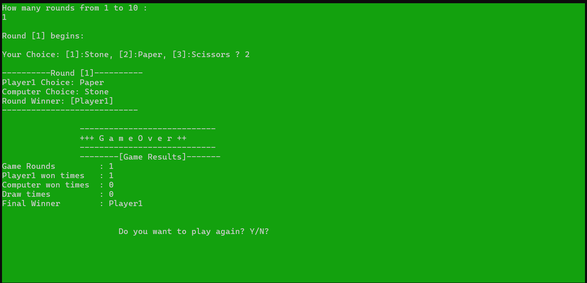
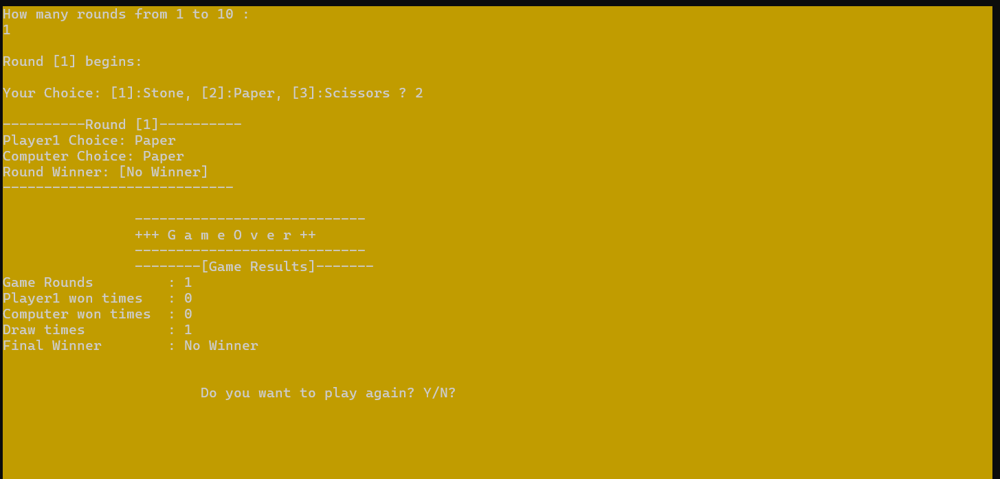
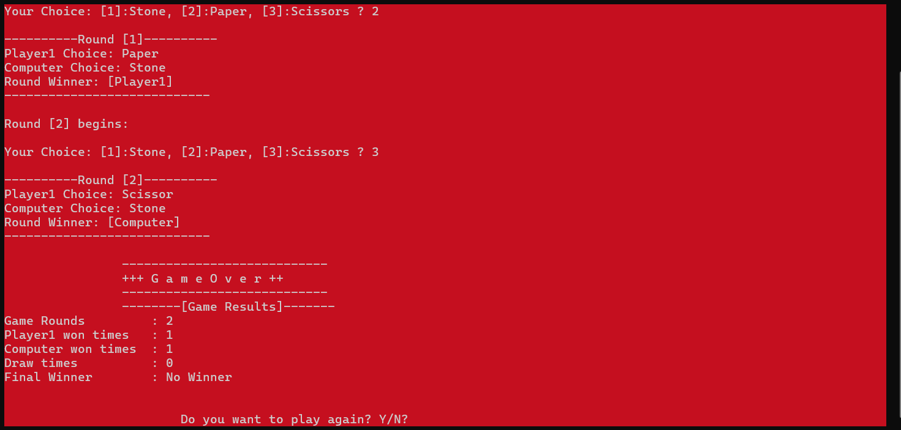

# Stone-Paper-Scissor (Project)
Console-based **1-Player** game built using C++ and functional programming principles.

---

---

## 🎮 Project Description (Gameplay)

- Select how many rounds you'd like to play (e.g., 3 or 5).
- In each round, choose one of the following:
  - `1` – Stone
  - `2` – Paper
  - `3` – Scissors
- The computer randomly makes its move.
- The winner is shown after each round.
- A final summary displays the number of wins, losses, and draws.

---

---
## ✨ Features

- 🔁 Multiple rounds with random computer choices
- ✅ Functional programming style
- 🎨 Terminal colors and system beep for fun feedback
- 📊 Final summary of game results
- 💻 Clean code structure
- ♻️ Replay Feature: Allows playing multiple rounds without restarting the program.

---
## 🌳 Code Structure
🎮 StartGame()                     -> Main game loop and replay handler  
    └── 📦 GameRounds()           -> Handles multiple rounds  
        └── 🎲 RoundResults()     -> Shows results for each round  
            └── 🎨 ColorsAndSounds() -> Sets color and plays sound  

🧮 FinalWinner()                  -> Determines final winner  
📊 GameResults()                  -> Displays summary after all rounds  
❓ WillContinue()                 -> Asks user if they want to play again  

---

---
